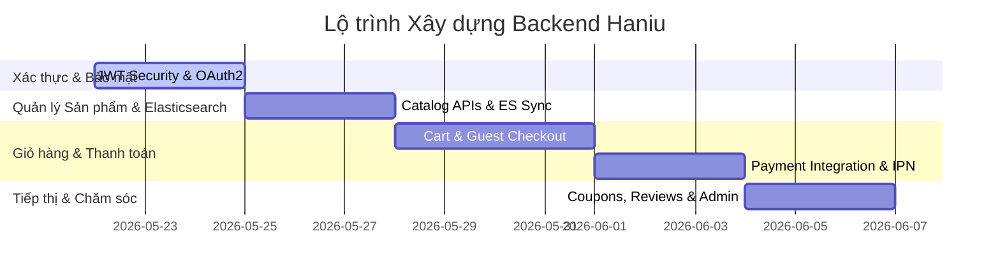

# Kế hoạch Xây dựng Backend Haniu (Backend Implementation Plan)

Tài liệu này vạch ra lộ trình xây dựng chi tiết cho toàn bộ các phân hệ còn lại của Backend Haniu (Gift Shop E-commerce). Kế hoạch được thiết kế theo cấu trúc từng bước (phát triển cuốn chiếu), đảm bảo tính module hóa và dễ bảo trì.

---

## 📅 Lộ trình Triển khai (Step-by-step Roadmap)

---

## 🛠️ Chi Tiết Từng Phân Hệ (Module Details)

### 1. Phân hệ Xác thực & Bảo mật (Authentication & Security)
* **Mục tiêu:** Thiết lập bộ lọc bảo mật, cơ chế cấp/thu hồi Access/Refresh Token và tích hợp Đăng nhập bằng Google.
* **Các bước thực hiện:**
  1. Tạo `SecurityConfig` cấu hình JWT Filter, phân quyền API (Public / Admin / User), cấu hình CORS.
  2. Tạo `AuthService` và `AuthController` xử lý:
     * Đăng ký (`/api/v1/auth/register`) / Đăng nhập (`/api/v1/auth/login`).
     * Làm mới token (`/api/v1/auth/refresh`) dựa trên bảng `refresh_tokens`.
     * Đăng xuất (`/api/v1/auth/logout`) thực hiện thu hồi (revoke) token trong DB.
  3. Tích hợp `OAuth2` Google để đăng nhập nhanh từ Frontend.

### 2. Phân hệ Sản phẩm & Elasticsearch (Product Catalog & Search)
* **Mục tiêu:** Cung cấp API quản lý danh mục quà tặng, lọc sản phẩm thông minh và đồng bộ dữ liệu sang Elasticsearch.
* **Các bước thực hiện:**
  1. Xây dựng CRUD cho Danh mục (`Category`), Thương hiệu (`Brand`), Bộ sưu tập (`Collection`).
  2. Xây dựng API quản lý Dịp lễ (`Occasion`) và Đối tượng nhận quà (`Recipient`).
  3. **Đồng bộ tự động (ES Sync Engine):**
     * Sử dụng **Spring JPA EntityListeners** (`@PostPersist`, `@PostUpdate`, `@PostRemove`) trên `Product` để tự động đẩy cập nhật sang Elasticsearch không đồng bộ (`@Async`).
  4. Xây dựng API tìm kiếm nâng cao ở `ProductElasticsearchRepository`:
     * Tìm kiếm mờ (Fuzzy), autocomplete theo tên.
     * Lọc sản phẩm theo khoảng giá, dịp lễ, đối tượng, danh mục, thuộc tính động.

### 3. Phân hệ Giỏ hàng & Cá nhân hóa (Cart & Personalization)
* **Mục tiêu:** Quản lý giỏ hàng đồng thời cho cả khách vãng lai (qua Session) và thành viên đã đăng nhập, cho phép nhập thông tin cá nhân hóa quà tặng.
* **Các bước thực hiện:**
  1. Xây dựng API giỏ hàng (`/api/v1/carts`):
     * Nếu có header `X-Session-ID`, quản lý giỏ hàng vãng lai.
     * Nếu có JWT token, quản lý giỏ hàng của User.
  2. Khi người dùng đăng nhập, tự động đồng bộ (Merge) giỏ hàng vãng lai vào giỏ hàng tài khoản.
  3. API thêm/sửa giỏ hàng nhận cấu hình cá nhân hóa `customizationInfo` (chứa text khắc tên, thiệp chúc mừng, in ảnh).

### 4. Phân hệ Đơn hàng & Guest Checkout (Order Processing)
* **Mục tiêu:** Thực hiện checkout an toàn, trừ tồn kho nguyên tử và tạo link theo dõi đơn hàng bảo mật cho khách vãng lai.
* **Các bước thực hiện:**
  1. API đặt hàng (`POST /api/v1/orders`):
     * Xác thực thông tin giỏ hàng, tính tổng tiền.
     * Áp dụng mã giảm giá `Coupon` (kiểm tra tính hợp lệ và cập nhật số lượt sử dụng nguyên tử).
     * **Trừ tồn kho nguyên tử** của các biến thể sản phẩm (`ProductVariant`) trong DB.
  2. Tạo đơn hàng với trạng thái mặc định `PENDING`.
  3. Sinh mã `trackingToken` (UUID) bảo mật cho đơn hàng. Khách vãng lai chỉ cần truy cập `/api/v1/orders/track?token={token}` là có thể xem trạng thái đơn hàng (đang chuẩn bị, đang giao) mà không cần đăng nhập tài khoản.

### 5. Phân hệ Thanh toán & Webhook (Payment Gateway Integration)
* **Mục tiêu:** Kết nối với các cổng thanh toán online (MoMo, VNPay) và xử lý xác nhận giao dịch từ Webhook (IPN).
* **Các bước thực hiện:**
  1. Tạo `PaymentService` tích hợp SDK hoặc gọi API trực tiếp của MoMo/VNPay để sinh link thanh toán dựa trên mã đơn hàng.
  2. API tạo giao dịch (`POST /api/v1/payments/create-link`).
  3. **Xử lý Webhook (IPN Controller):**
     * Tiếp nhận callback từ cổng thanh toán.
     * Xác thực chữ ký số (Checksum Security Check) để tránh giả mạo request.
     * Cập nhật trạng thái đơn hàng (`PAID` hoặc `FAILED`) và lưu log `rawResponse` từ cổng thanh toán vào bảng `payments` phục vụ đối soát.

### 6. Phân hệ Tiếp thị, Feedback & Hệ thống (Marketing, Feedback & System)
* **Mục tiêu:** Quản lý Coupon, Banner, Đánh giá sản phẩm và ghi vết hoạt động (Audit).
* **Các bước thực hiện:**
  1. Quản lý `Coupon`: Tự động khóa coupon khi hết hạn hoặc hết lượt.
  2. Quản lý `Review`: Cho phép khách hàng đã mua sản phẩm đánh giá (`rating`, `comment`), cập nhật trung bình rating sản phẩm.
  3. **Audit Log System:** Dùng Spring AOP (`@Aspect`) để ghi nhận mọi hành động chỉnh sửa dữ liệu nhạy cảm của Admin (sửa giá, sửa tồn kho, sửa coupon) vào bảng `audit_logs`.
