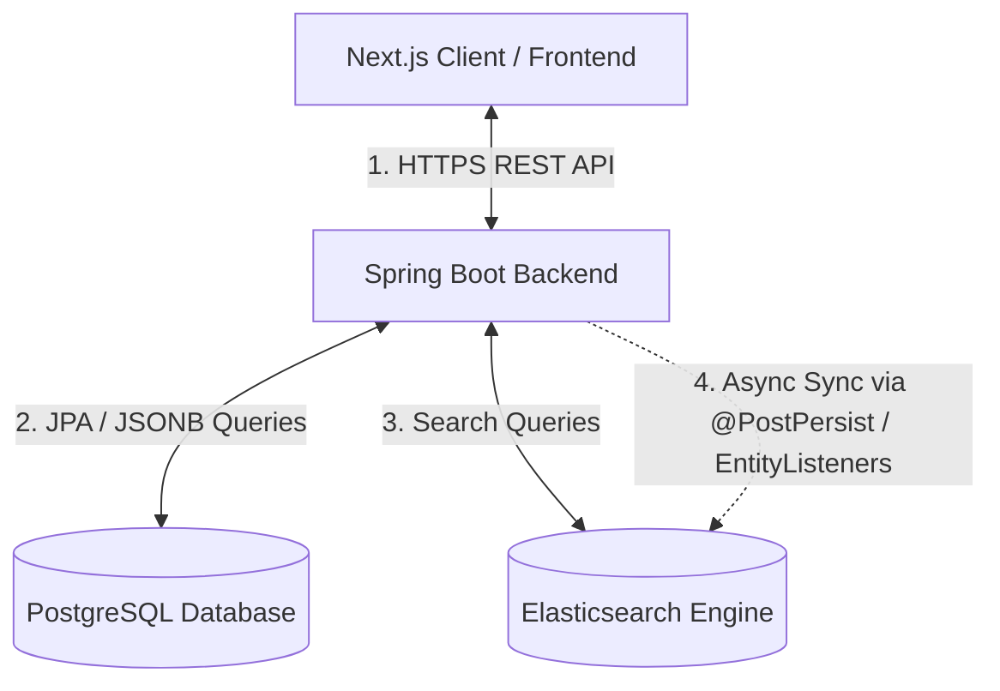

<div align="center">

# 🎁 Haniu
### Premium Gift Shop E-Commerce Platform

*Một nền tảng thương mại điện tử hiện đại, tối ưu và chuyên biệt cho **Quà tặng Cao cấp & Đồ lưu niệm***

[](https://openjdk.org/)
[](https://spring.io/projects/spring-boot)
[](https://nextjs.org/)
[](https://www.postgresql.org/)
[](https://www.elastic.co/)
[](LICENSE)

---

[Key Features](#-tinh-nang-noi-bat) • [Tech Stack](#-cong-nghe-su-dung) • [System Architecture](#-kien-truc-he-thong) • [Project Structure](#-cau-truc-thu-muc-du-an) • [Database Design](#-thiet-ke-co-so-du-lieu) • [Getting Started](#-huong-dan-cai-dat) • [Deployment](#-trien-khai-production)

</div>

---

## 📖 Giới thiệu (Overview)

**Haniu** là giải pháp thương mại điện tử chuyên biệt toàn diện phục vụ cho ngành bán lẻ **Quà tặng cao cấp & Đồ lưu niệm** (quà tặng sự kiện, sinh nhật, ngày lễ như Valentine, Quốc khánh, quà tặng doanh nghiệp cá nhân hóa, set combo quà tặng).

Hệ thống được thiết kế theo kiến trúc **Modular Monolith** vững chắc, kết hợp độ tin cậy giao dịch mạnh mẽ của **Spring Boot + PostgreSQL** với tốc độ tìm kiếm vượt trội của **Elasticsearch**. Dự án giải quyết triệt để các bài toán thực tế đặc thù như: quản lý thuộc tính động, tùy biến thông tin cá nhân hóa quà tặng, đặt hàng vãng lai không cần tài khoản, và bảo mật tránh quá tải tồn kho khi chạy Flash Sale.

---

## 🚀 Các Tính Năng Nổi Bật (Key Features)

### 🎁 1. Cá nhân hóa quà tặng (Gift Personalization)
* Khách hàng dễ dàng ghi yêu cầu khắc tên, in hình, chọn màu gói quà, hoặc viết thiệp chúc mừng riêng biệt (`customization_info`) ngay khi thêm sản phẩm vào giỏ hàng hoặc tiến hành thanh toán.
* Dữ liệu tùy biến được cấu trúc linh hoạt bằng định dạng **JSONB** dưới database, giúp dễ dàng mở rộng thêm các kiểu cá nhân hóa mới mà không làm thay đổi lược đồ database.

### ⚙️ 2. Thuộc tính động 100% (Fully Dynamic Attribute Engine)
* Quản trị viên tự định nghĩa cấu trúc thuộc tính (kích thước hộp quà, chất liệu giấy gói, xuất xứ...) trực tiếp từ giao diện Admin theo từng danh mục sản phẩm mà **không cần đổi cấu trúc Database hay chỉnh sửa code Java backend**.

### 📅 3. Bộ lọc thông minh theo Dịp lễ & Đối tượng (Occasion & Recipient Filters)
* Cho phép phân loại và lọc nhanh quà tặng theo các ngày lễ lớn (Sinh nhật, Quốc khánh 2-9, Nhà giáo 20-11, Quốc tế Phụ nữ 8-3) kết hợp với đối tượng nhận cụ thể (Bạn trai, Bạn gái, Thầy cô, Bố mẹ, Đối tác/Doanh nghiệp).

### 🛒 4. Mua nhanh vãng lai (Guest Checkout & Tracking)
* Khách hàng vãng lai có thể đặt mua quà nhanh chóng mà không cần đăng ký tài khoản.
* Tra cứu tình trạng đơn hàng bảo mật qua số điện thoại/email đi kèm một mã token (`trackingToken` dạng UUID) được mã hóa.

### ⚡ 5. Tìm kiếm siêu tốc với Elasticsearch (ES Search Integration)
* Đồng bộ hóa dữ liệu danh mục, thuộc tính động, và thông số sản phẩm sang Elasticsearch.
* Hỗ trợ tìm kiếm mờ (Fuzzy Search), gợi ý tự động (AutoComplete) và bộ lọc thuộc tính động đa chiều (Faceted Search) với độ trễ dưới 50ms.

### 🛡️ 6. An toàn chống tranh chấp (High Concurrency & Flash Sale Protection)
* Tích hợp cơ chế khóa lạc quan (`@Version` Lock) trên các thực thể nhạy cảm.
* Sử dụng các câu lệnh SQL cập nhật nguyên tử (Atomic updates) giúp đảm bảo an toàn tuyệt đối cho số lượng tồn kho (Stock) và giới hạn sử dụng mã giảm giá (Coupon usage limit) ngay cả khi có hàng ngàn lượt truy cập đồng thời.

---

## 🛠️ Công Nghệ Sử Dụng (Technology Stack)

| Thành phần | Công nghệ | Chi tiết sử dụng |
| :--- | :--- | :--- |
| **Backend Framework** | Spring Boot 3.x | Java 21, Spring Data JPA, Spring Security |
| **Search Engine** | Elasticsearch 8.x | Spring Data Elasticsearch (Đồng bộ không đồng bộ) |
| **Database** | PostgreSQL | Lưu trữ dữ liệu quan hệ & ứng dụng kiểu dữ liệu JSONB |
| **Authentication** | JWT & OAuth2 | AccessToken & RefreshToken, Đăng nhập Google |
| **Frontend Framework** | Next.js (React) | TypeScript, App Router |
| **Styling** | TailwindCSS & Vanilla CSS | Giao diện Responsive, Custom UI Components |
| **State Management** | Redux Toolkit & Context API | Quản lý trạng thái giỏ hàng & session người dùng |

---

## 📐 Kiến Trúc Hệ Thống (System Architecture)

Hệ thống sử dụng cơ chế đồng bộ dữ liệu không đồng bộ (Asynchronous Sync) từ Database quan hệ (PostgreSQL) sang Elasticsearch nhằm tối ưu hóa hiệu năng và độ trễ của trải nghiệm tìm kiếm:



> [!NOTE]
> Việc tách biệt luồng truy vấn dữ liệu giao dịch (PostgreSQL) và luồng tìm kiếm/lọc sản phẩm (Elasticsearch) giúp hệ thống hoạt động cực kỳ mượt mà và giảm tải đáng kể cho Database Core.

---

## 📂 Cấu Trúc Thư Mục Dự Án (Project Structure)

```text
haniu/
├── backend/                       # Source code Backend (Spring Boot)
│   ├── src/main/java/.../haniu/
│   │   ├── config/                # Cấu hình Security, CORS, Elasticsearch, JPA Auditing
│   │   ├── controller/            # REST Controllers định nghĩa các API Endpoints
│   │   ├── dto/                   # Data Transfer Objects cho Request/Response
│   │   ├── entity/                # Các JPA Entity ánh xạ xuống PostgreSQL DB
│   │   │   ├── cart/              # Cart, CartItem (xử lý giỏ hàng tài khoản & vãng lai)
│   │   │   ├── feedback/          # Review, Wishlist
│   │   │   ├── marketing/         # Coupon, Banner
│   │   │   ├── order/             # Order, OrderItem, Payment
│   │   │   ├── product/           # Product, Variant, Occasion, Recipient, Category...
│   │   │   └── user/              # User, RefreshToken, UserAddress
│   │   ├── repository/            # Tầng JPA & Elasticsearch Repositories
│   │   └── service/               # Tầng xử lý Logic Nghiệp vụ (Business Service)
│   └── pom.xml                    # File cấu hình dependencies Maven
├── front-haniu/                   # Source code Frontend (Next.js)
│   ├── src/                       # Components, Pages, Hooks, Styles & Redux Store
│   ├── public/                    # Static Assets (Images, Icons...)
│   └── package.json               # File cấu hình dependencies NPM
├── DATABASE_OVERVIEW.md           # Tài liệu chi tiết thiết kế Database & JSONB
├── BACKEND_IMPLEMENTATION_PLAN.md # Kế hoạch & lộ trình phát triển Backend
└── DEPLOYMENT.md                  # Hướng dẫn chi tiết các bước Deploy lên Cloud
```

---

## 💾 Thiết Kế Cơ Sở Dữ Liệu (Database Design)

Hệ thống được thiết kế tối ưu hóa chỉ mục (Indexes) để toàn bộ các truy vấn lọc theo Slug, Trạng thái, và Khóa ngoại đều có thời gian phản hồi **< 1ms**.

> [!TIP]
> **Tối ưu hóa với JSONB:** Trường `customization_info` trong bảng `CartItem` và `OrderItem` được lưu dưới dạng JSONB giúp lưu trữ linh hoạt mọi cấu trúc cá nhân hóa (văn bản khắc, link hình ảnh tải lên, lựa chọn màu sắc gói quà) mà không cần tạo thêm các bảng liên kết phức tạp.

Chi tiết về thiết kế thực thể, sơ đồ quan hệ ERD và đặc tả bảng dữ liệu, vui lòng xem tại [DATABASE_OVERVIEW.md](file:///c:/Users/hieut/Desktop/haniu/DATABASE_OVERVIEW.md).

---

## ⚙️ Hướng Dẫn Cài Đặt (Getting Started)

### Yêu cầu hệ thống (Prerequisites)
* **Java Development Kit (JDK) 21** trở lên.
* **Node.js 18.x** trở lên & công cụ NPM.
* **Docker** (khuyên dùng để dựng nhanh PostgreSQL & Elasticsearch).

---

### 1. Khởi chạy các dịch vụ lưu trữ (Docker)
Nếu bạn đã cài Docker, hãy khởi chạy nhanh PostgreSQL và Elasticsearch bằng lệnh:
```bash
docker run -d --name haniu-postgres -e POSTGRES_DB=haniu_db -e POSTGRES_USER=postgres -e POSTGRES_PASSWORD=your_password -p 5432:5432 postgres:15

docker run -d --name haniu-elasticsearch -p 9200:9200 -e "discovery.type=single-node" -e "xpack.security.enabled=false" elasticsearch:8.11.1
```

---

### 2. Cấu hình & Chạy Backend (Spring Boot)

1. Truy cập vào thư mục `backend`:
   ```bash
   cd backend
   ```
2. Tạo file cấu hình `src/main/resources/application-local.properties` (hoặc sửa đổi file `application.properties` hiện có):
   ```properties
   spring.datasource.url=jdbc:postgresql://localhost:5432/haniu_db
   spring.datasource.username=postgres
   spring.datasource.password=your_password
   
   spring.elasticsearch.uris=http://localhost:9200
   
   # JWT Configuration
   jwt.secret=your_super_secret_jwt_key_should_be_large_enough_to_prevent_security_issues
   jwt.expiration=900000
   ```
3. Tiến hành compile và chạy ứng dụng:
   ```bash
   # Dùng maven wrapper để chạy
   ./mvnw clean compile
   ./mvnw spring-boot:run
   ```
   *Mặc định, server Backend sẽ chạy tại cổng: `http://localhost:8000` (hoặc `http://localhost:8080` tùy cấu hình).*

---

### 3. Khởi chạy Frontend (Next.js)

1. Truy cập vào thư mục `front-haniu`:
   ```bash
   cd ../front-haniu
   ```
2. Tạo file cấu hình `.env.local` ở thư mục gốc của frontend:
   ```env
   NEXT_PUBLIC_API_URL=http://localhost:8000
   ```
3. Cài đặt các thư viện phụ thuộc và chạy môi trường dev:
   ```bash
   npm install
   npm run dev
   ```
   *Ứng dụng client sẽ khởi chạy tại: `http://localhost:3000`.*

---

## 🚀 Triển Khai Production (Deployment)

Dự án đã sẵn sàng để cấu hình CI/CD và triển khai tự động lên các nền tảng đám mây lớn:
* **Frontend (Next.js):** Khuyên dùng **Vercel** để tối ưu hóa SSR & CDN.
* **Backend (Spring Boot):** Sử dụng **Render** (đã cấu hình sẵn `Dockerfile` ở thư mục `/backend`).
* **Database (PostgreSQL):** Sử dụng **Supabase** hoặc **Neon DB**.

Hướng dẫn cấu hình biến môi trường và các bước deploy chi tiết, vui lòng xem tại [DEPLOYMENT.md](file:///c:/Users/hieut/Desktop/haniu/DEPLOYMENT.md).

---

## 📅 Lộ Trình Phát Triển (Roadmap)

Chi tiết lộ trình hoàn thiện các tính năng nâng cao (như tích hợp cổng thanh toán MoMo/VNPay, cơ chế Webhook IPN, và hệ thống AOP Audit Log) được trình bày tại [BACKEND_IMPLEMENTATION_PLAN.md](file:///c:/Users/hieut/Desktop/haniu/BACKEND_IMPLEMENTATION_PLAN.md).

---

## 📄 Giấy phép (License)

Dự án được phân phối dưới giấy phép **MIT License**. Xem file `LICENSE` để biết thêm chi tiết.

---
<div align="center">
  <sub>Được phát triển bởi <b>thtieu22</b>. Mọi thắc mắc hoặc yêu cầu đóng góp ý kiến vui lòng gửi PR hoặc mở Issue.</sub>
</div>
